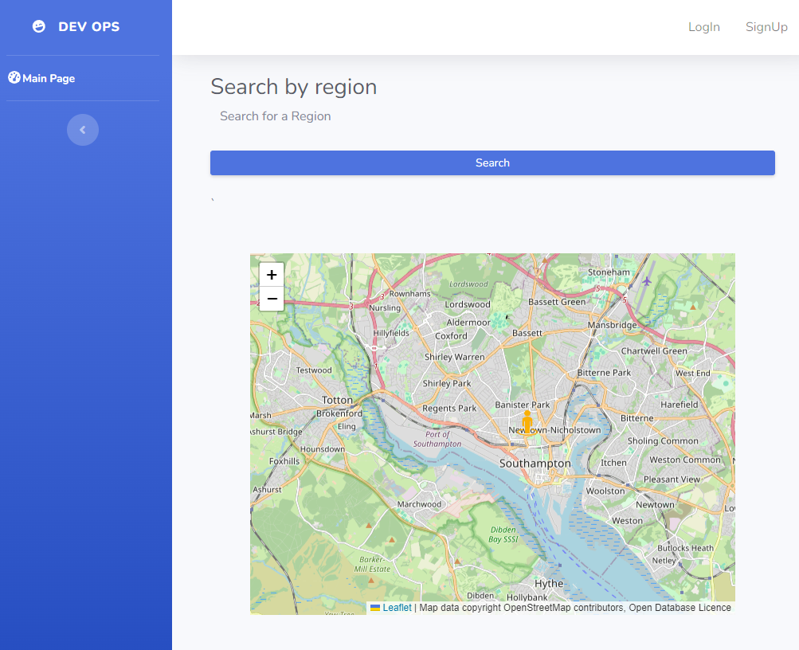

# Devops_com619

## Point of intrest app

### This application allows a user to:
* Optionally, store a Point of Interest along with an image.
* If the user has an account, they can retrieve a list of all stored Points of Interest from the database.
* The application offers flexibility by allowing users to switch between multiple languages.


 ## How do i get started?
 * Clone the reposatory
 ```
 git clone https://github.com/Boldizsarb/Devops_com619.git
 ```
* Cmd the root directory and input:
```
 docker-compose up --build
 ```
* Once you see the sign of: app listening at http://localhost:3000 ✓
* The Aplication can be observed on that link.