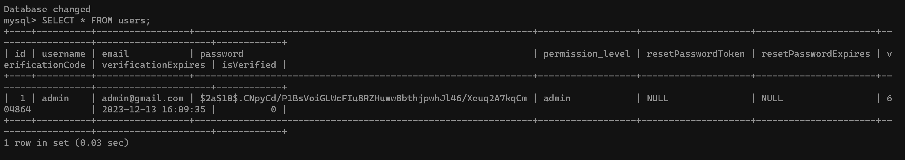
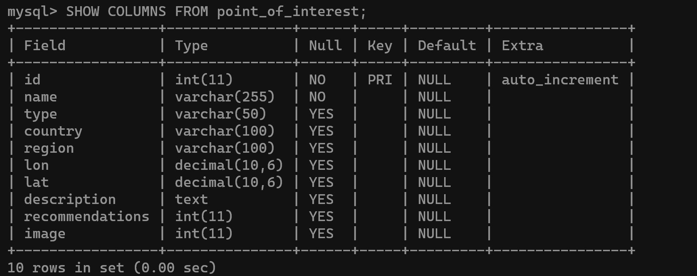
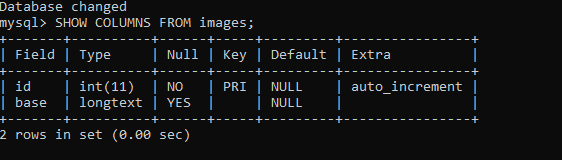
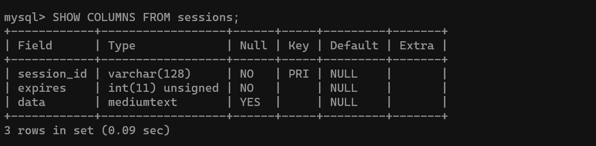

# Documentation 

## Content:
1. [Link to Section 1](#section1)
2. [Project  Initiation](#section2)
3. [Devops Development Practices](#section3)
4. [Deployment with Azure](#section4)
5. [Technology overview](#section5)
6. [Containerizing](#section6)
7. [Database](#section7)
8. [Sessions](#section8)
9. [Location](#section9)
10. [MVC Arhitecture](#section10)
11. [Testing](#section11)
12. [Front-End](#section12)
13. [Users](#section13)
14. [Point of Interest](#section14)
15. [Internationalization (i18n)](#section15)
16. [Terms and Conditions](#section16)


## 1. Running the Project: <a id="section1"></a>

* Video is available at: https://www.youtube.com/watch?v=1hUGi53_KE4&ab_channel=BoyszyDon
* Clone the reposatory
* Cmd the root directory and input: docker-compose up --build
* Once you see the sign of: app listening at http://localhost:3000 ✓
* The Aplication can be observed on that link. 


## 2. Project  Initiation:   <a id="section2"></a>

* Formation of a cross-functional DevOps team with a focus on role distribution.
* Definition of project objectives, encompassing a preliminary identification of the technological stack to be utilized.
* Establishment of a collaborative GitHub repository for project development.
* Custom branches have been generated, with an individual branch assigned to each team member.
* Adoption of the Apache license for project licensing and intellectual property management.
* Construction of a feature list and project plan utilizing a visual Kanban approach within the Agile framework using GitHub projects.

## 3. Devops Development Practices: <a id="section3"></a>

* Agile development facilitated rapid changes, while parallel programming allowed the team to work on different components simultaneously with minimal conflicts or issues.

### Preparation 

* Conducting research to identify and assess the requisite technologies for the successful implementation of the project.
* Formulating a comprehensive meeting strategy, including the establishment of project timelines and milestones.
* Setting up objectives and deliverables for each sprint.
* Devising a schedule for regular weekly meetings, employing the Scrum Daily Standup format, to facilitate discussions concerning project progress, obstacles encountered, and future plans.

### Sprint Planing 

* Creating a clear project plan involves defining the required features and assigning tasks to each team member.
* Setting deadlines for task completion is essential for effective project management.
* Conducting testing by a team member who did not work on a specific feature helps ensure thorough quality control and identifies potential issues or bugs.

### Sprint 

* Present the current work for feedback.
* In a retrospective meeting, review feedback, identify potential changes, and take action accordingly.
-----------------------------------------------------------------------------------------

### Kanban 

* Visualizing individual team member tasks is achieved using GitHub Projects for clear project management and progress tracking.
* https://github.com/users/Boldizsarb/projects/5/views/1?layout=board

## 4. Deployment with Azure:  <a id="section4"></a>

- **Technology Employed**: Evaluated the necessary technologies, including Docker, Nginx, and SSL certificates.

### Github workflow

### Docker

- **Docker Volumes**: Mapped local directories to Docker container volumes to ensure SSL certificates were properly loaded by Nginx.

### Azure

- **Azure Configuration**: Configured the Azure virtual machine to run the Dockerized application.
- **DNS and IP Setup**: Configured DNS settings and public IP address in Azure to match the SSL certificate's domain.
- **Firewall Configuration**: Configured the Azure firewall to allow traffic on port 443 for secure HTTPS connections.

### SSL 
- **Self-Signed SSL**: Created a self-signed SSL certificate using OpenSSL to secure local development.
- **Let's Encrypt Certificate**: Obtained a free Let’s Encrypt certificate from the Internet Security Research Group (ISRG)

### NGINX

- **HTTPS Redirection**: Set up Nginx to redirect HTTP traffic to HTTPS to ensure secure connections.
- **Nginx Configuration**: Configured Nginx to use SSL by setting up the correct paths to the certificate (`cert.pem`) and key (`key.pem`) for local deployment.

### Troubleshooting 

- **Troubleshooting**: Addressed various issues such as file not found errors, incorrect MIME types, and SSL protocol errors. Adjusted Docker volume mappings and Nginx configurations as needed.
- **Testing**: Continuously tested the secure connection in the browser, ensuring the HTTPS protocol was effective, and troubleshooting any connection errors.


## 5. Technology overview:  <a id="section5"></a>

* To enhance modularity, the project leverages ES6 JavaScript runtimes, resulting in the use of '.mjs' file extensions.
* Babel used to compile React on the front end. 

## 6. Containerizing the entire project using Docker:   <a id="section6"></a>

### Dockerfile: 
* Upon the compilation of the Docker image, the Dockerfile assumes responsibility for defining the command-line instructions for executing the containerized application.
```
FROM node:14
```
* A Node.js image was generated instead of the customary Ubuntu image, streamlining the process by eliminating the need for additional setup steps related to Node.js configuration and dependencies.

### .dockerignore file: 

* By 
```
node_modules
```
excluding node modules, we enhance deployment efficiency and accelerate build times, Docker selectively includes only production code in its images, reducing overall size by excluding unnecessary dependency packages

### docker-compose.yml file

* Maximizing simplicity through automation with Docker Compose.
* This docker-compose architecture allows the entire application and its dependencies to be run portably through Docker while maintaining security, persistency of data and automated certificate renewal.
* The configurations also facilitate communication between the containers ensuring proper startup order.
* This configuration file establishes four containers: Which includes:

      - The Application: which builds from the Dockerfile and runs the Node.js app. This depends on MYSQL , env vars and waits for MySQL to be ready before starting the app.

      - NGINX: Using reverse proxy using Nginx. Port Mapping for HTTP/HTTPS. This volume maps SSL certificate files from the host. Depends on the app container.

      - Certbot: This automatically renews SSL certificates with Certbot. Volume gives access to renewal folders and allows renewed certificates to be saved externally. Dependson Nginx.
      
      - Volumes: This named the volumes mapped to local host directories externally preserving the database files, SSL certificates and otherpersistent data needed between container rebuilds.
* The database container initiates after the project container 
```
 depends_on:
      - mysql
```
and encompasses all the essential environment variables necessary for establishing a connection.
* Additionally, a volume has been mounted to the database container to ensure data persistence beyond the container's lifecycle.


## 7. Database   <a id="section7"></a>

### Technologies Used
- **MySQL Pooling:** Managed through `pool.mjs` for database connections.
```
const pool = mysql.createPool({
  host: HOST || 'mysql',
  user: USER || 'devops',
  password: PASSWORD || 'devops',
  database: DATABASE || 'devops',
  waitForConnections: true,
  connectionLimit: 10,
  queueLimit: 0,
});
```
* The program is designed for modularity, with components being exported and imported as needed.
- ENV file: 
- In local development, sensitive information is stored in a .env file, while in production (hosted environment), GitHub secrets are used for secure configuration.
```
MYSQL_HOST='mysql'
MYSQL_USER='devops'
```


### Implementation Details
- Establishes a connection to the database using a connection pool.
- Checks and creates essential tables if they don't exist:
- Servercheck.mjs contains all the database configuration
  - **users:** Stores user information with fields like username, email, password, and verification details.
  - Content: 
  - **point_of_interest:** Contains details of various points of interest like name, type, country, region, and coordinates.
  - Content: 
  - **images:** A table dedicated to storing image data.
  - Content: 
  - **sessions:** Manages session data for user authentication.
  - Content: 
- Releases the database connection back to the pool after operations are completed.
```
 connection.release();
```

## 8. Session Management Technologies  <a id="section8"></a>

### Technologies Used:
- **express-session:** Utilized for creating session objects in the application.
- **MySQLStore (from express-mysql-session):** Deployed for storing session data.
- **MySQL:** Database system used for persisting session information.

### Implementation Details:
1. **Session Creation:** Sessions are created using `express-session`. This facilitates the management of user states within the application.
```
app.use(session({
    name: 'session_name',
    secret: 'developer',
    resave: false,
    saveUninitialized: true,
    store: sessionStore, // Use a store to store session data 
    cookie: { 
        maxAge: 3600000, // 1 hour in milliseconds
        sameSite: true,
        secure: false, // Set to true if using https
        httpOnly: true,
    },
    credentials: true, // Allows credentials (cookies) to be sent with cross-origin requests
}));
```

2. **Session Storage:** addter the sessions beeing created they are stored the MySQL database in a table named "sessions", managed through `MySQLStore`.
```
const sessionStore = new (MySQLStore(session))({
    clearExpired: true,// Clear expired sessions automatically
    expiration: 86400000,// Set the session expiration time to 24 hours (in milliseconds)
    checkExpirationInterval: 3600000,// Check for session expiration every 1 hour (in milliseconds)
    createDatabaseTable: true, // Create the necessary database table to store sessions
      }, 
    pool);
   ```
3. **Session Contents:**
   - Each session contains the username of the logged-in user.
   - Sessions have an expiration date to ensure security and manage lifecycle.
4. **Access Control:**
   - **Tokenization:**  User sessions are encrypted before being stored in the database and decrypted when retrieved to safeguard users' sensitive information.
   - Technology used: JSON Web Tokens: https://jwt.io/introduction
      ```
      const token = jwt.sign({ username }, JWT_SECRET, { expiresIn: EXPIRES_IN });
            res.status(200).json({ message: "Login successful!", token, user: { 
      ```
   - **Admin Users:** Granted full access to all application features.
   - **Regular Users:** Limited access to the main page and functionality to add points of interest (POIs).
   - **Non-Logged-In Users:** Access restricted to the main page only.


## 9. Region Function Documentation     <a id="section9"></a>
### Technologies Used
- **Leaflet.js:** For map functionalities and interactions.
- **Geolocation API:** To retrieve user's current location.
- **Fetch API:** For server communication on user's location.

### Implementation Details
- Initializes a map using Leaflet.js.
- Retrieves user's location and updates map view and markers accordingly, if the location is denied pins the location at the predifined location of "[51.05, -0.72]"(please note that if the location is not allowed the yellow man icon will not appear in the map).
```
 async function successFunction(position) {
      const lat = position.coords.latitude;
      const lon = position.coords.longitude;
```

- If agreed by the user the map will store the users location in a session;

## 10. MVC Arhitecture    <a id="section10"></a>

### Modell

* Interacts with the database.
* ES6 enables the importation of the database module for establishing and terminating connections.
* To prevent collisions or blocking the main thread, all functions are designed as asynchronous (async).
* SQL queries are responsible for handling CRUD (Create, Read, Update, Delete) operations.
* Every query is parameterized to mitigate the risk of SQL injection.
```
'DELETE FROM point_of_interest WHERE id = ?’
```
### Controller: 

* For each static function called on the class, the initial step involves retrieving all variables from the request body.
* It populates a new model instance with these variables, executes the HTTP request, and returns the results in the form of an object.
* Subsequently, the results are parsed into JSON format.
```
res.json(pointsOfInterest);
      or
res.status(500).json({ error: error.message });
```
* This parsing applies to both the actual object and any caught errors.

### Routes: 

* Express.js is employed for defining and managing routes within the application.
* Middleware is configured within the server.mjs file, and all routes are isolated and defined with their own respective prefixes.
```
app.use('/poi', Poirouter);
```
* After specifying the route path, an authentication middleware is added to manage the capabilities of various user types
```
router.get('/pointsOfInterest', isAuthenticated
```
* Then, the appropriate method is invoked from the controller to handle the specific functionality associated with that route
```
router.get('/pointsOfInterest', isAuthenticated,PointsOfInterestController.getAllPointsOfInterestController);
```

## 11. Testing    <a id="section11"></a>

### Automated Testing

### Swagger

* Documentation available at: http://localhost:3000/api-docs/
* To improve accessibility, a sidebar hyperlink was added. 
* Swagger options is used to define the metadata and sources of information required for generating the document.
* To generate a Swagger specification for the API annotations were used in the route files, as follows: 

```
/**
* @swagger  (Annotations)
* /poi/pointsOfInterest:  (route)
*   get:  (get request)
```
* Schema was used to describe the properties and their types for the object and then tags to categorize the APIs
```
/**
 * @swagger
 * components:
 *  schemas:
```
* Each request is associated with a predefined response to provide clear and consistent descriptions.

```
*     responses:
*       201:
*         description: POI created successfully.
```
* Finally, Swagger UI transforms into an interactive format when accessed via the "/api-docs" route.

## 12. Front-End    <a id="section12"></a>

### Design and Responsiveness
To achieve a professional-looking website, we have opted to utilize a bootstrap template for both design and responsiveness. By employing this template, we can easily incorporate jQuery and effortlessly manipulate the entire website.

The website's pages will be fully responsive, automatically adjusting the size of all elements based on the screen size, ensuring that all content is properly visible.
* The sidebar will feature a button that enables users to expand or shrink its size according to their preference.

* When users scroll to the bottom of the page, a button will appear, facilitating their swift return to the top of the page, particularly when the top bar is no longer accessible. 
* The top bar will include a button that is exclusively visible on smaller screen sizes, allowing users to toggle the visibility of the sidebar, providing them with enhanced control over their browsing experience.

### React

* React is utilized to render page content for an improved user experience.
* JavaScript manages database communication, ensuring accessibility of all features.
* This approach prioritizes speed, security, and resource efficiency.
* A "common.js" file centralizes common components (e.g., topbar, sidebar, footer) for streamlined management across all pages.

* To utilize React, it is essential to import the React library and its corresponding file into the HTML page:
```
<script
      type="text/javascript"
      src="https://unpkg.com/react@18/umd/react.development.js"
      crossorigin
></script>
<script
      type="text/javascript"
      src="https://unpkg.com/react-dom@18/umd/react-dom.development.js"
      crossorigin
></script>
<script
      type="text/javascript"
      src="https://unpkg.com/babel-standalone@6/babel.min.js"
></script>

<script type="text/babel" src="scripts/index.js"></script>
```
* Afterward, it is necessary to generate a basic div element and assign it a unique identifier so that we can retrieve it within the reac.js file:

```
<div id="root"></div>
```
There is no further action required on the actual HTML page now, as all modifications will occur in the React file. Although a few div elements have been created, their purpose is solely to ensure the proper placement of each page element.

* In the React file, it is necessary to identify the appropriate div element where the information will be displayed. Subsequently, a function should be assigned to handle all interactions and render the desired content.

```
const root = ReactDOM.createRoot(document.getElementById("root"));
root.render(<Region title="Search by region" />);
```

In this instance, we are examining the index page, which will serve as the platform for showcasing and managing user interactions with the map and points of interest (POIs). Each functionality possesses its own distinct purpose, enabling the application to effectively communicate with the database and accurately present all relevant information to the user.

```
function recommend(id)
function sharePoi(id)
async function fetchImage(poi)
function searchByRegion()
function takeMeThere(lon, lat)
```
Once the data has been retrieved and manipulated, we utilize a return statement to exhibit all the desired content on the page.
```
return()
```


## 13. Users     <a id="section13"></a>

### Front-end User

* User accounts are categorized into three distinct groups: guests, standard users, and administrators.
* The front-end interface is responsive, dynamically presenting data. 
* User types:
1. **Guests** represent the lowest access level within. Their capabilities are limited to: 
      1. searching for points of interest (POIs) 
      2. utilizing the user authentication functionalities, which include login, signup, and password recovery.
2. **Users** encompass all individuals with registered accounts who have successfully logged into the website. 
      1. They enjoy expanded privileges, including the ability to add new points of interest (POIs), 
      2. Access the POI page showcasing all POIs, 
      3. view their profile page, and make edits to their personal information.
3. **Admins** have unrestricted access and control over all website functions, 
      1. including adding/editing POIs, 
      2. managing user profiles, and overseeing user accounts,
      3. they can view and delete user accounts through the users page.
* Top and side bar are implemented to display appropriate options dinamically for each user based on their access level.
Let us examine the operational features for creating an account.
* When the user selects the button located on the top bar to initiate the signup process, a form will promptly appear, prompting the user to input their username, email address, and password. Additionally, a second password field will be presented to ensure the user does not mistakenly enter an incorrect password. 
```
<div className="form-group">
      <input
            type="text"
            className="form-control form-control-user"
            placeholder="Enter Username"
            value={username}
            onChange={(e) => setUsername(e.target.value)}
            required
            />
      <input
            type="email"
            className="form-control form-control-user"
            placeholder="Enter Email Address "
            value={email}
            onChange={(e) => setEmail(e.target.value)}
            required
      />
      <input
            type="password"
            className="form-control form-control-user"
            placeholder="Enter Password"
            value={password}
            onChange={(e) => setPassword(e.target.value)}
            required
      />
      <input
            type="password"
            className="form-control form-control-user"
            placeholder="Confirm Password"
            value={confirmPassword}
            onChange={(e) => setConfirmPassword(e.target.value)}
            required
      />
      <button
            type="submit"
            className="btn btn-primary btn-user btn-block"
      >
            Sign Up
      </button>
      {error && <p className="error">{error}</p>}
</div>
```
Each input element is equipped with several attributes to enhance its functionality and user experience. 
* Firstly, the type attribute ensures that the input is validated, secured, and restricts the user from entering incorrect data. 
* Secondly, the className attribute is utilized to improve the visual appearance of the input elements. 
* Thirdly, the placeholder attribute is employed to display a text prompt, guiding the user on what information should be entered into the input field. 
* Additionally, the value attribute is associated with a globally created variable that stores the user's data, which is initially empty. 
* The onChange function is responsible for updating this global variable, ensuring that it contains the most up-to-date values entered by the user. 
* Lastly, the inputs can be marked as required, which prevents the user from submitting the form without providing all the necessary data. 
Once the user clicks the "Sign up" button and all the aforementioned checks are successfully verified, the program will invoke a function to handle the subsequent steps.

```
const handleSignUp = ()
```

This function is designed to perform several checks before proceeding with specific actions. It will only proceed if all the checks pass, and it will throw errors if any of the tests fail.
* Firstly, it will verify if the password and confirm password inputs match. This ensures that the user has entered the correct password.
```
if (password !== confirmPassword) {
      setError("Passwords don't match!");
      return;
}
```
* Next, it will double-check if the user has entered actual values, preventing them from entering only an empty space. This ensures that the inputs are not left blank.
```
if (!username.trim() || !email.trim() || !password.trim()) {
      setError("Please fill in all fields");
      return;
}
```
* Once all these checks are completed, the function will create a JSON variable that contains the three inputs. This variable will be used to send the data to the database.
```
const data = { username, email, password };
```
* Before adding a new user to the database, the function will utilize this data to check if the username is already being used by someone else. This step is taken to prevent multiple users from having the same username.
```
fetch("/user/checkusername", {
      method: "POST",
      headers: {
        "Content-Type": "application/json",
      },
      body: JSON.stringify(data),
})
```
The data is being passed in the body as JSON, which is a safer approach compared to passing the data in the actual path. This method helps prevent random attacks by unauthorized individuals.

Upon receiving the response from the fetch request, the system will verify the success of the process by reading the response code that was sent back. Based on this code, an appropriate message will be displayed to the user indicating whether the process was successful or not.

In this particular example, the system will first check for the existence of the user. If the fetch request returns a successful response, it will then proceed to call another fetch request to add the new user.
```
.then((response) => {
      if (response.ok) {
      // If the username is available, send a POST request to the server to create a new user
            fetch("/user/signup", {
            method: "POST",
            headers: {
              "Content-Type": "application/json",
            },
            body: JSON.stringify(data),
            })
            .then((response) => {
              if (response.ok) {
                // If the user was created successfully, redirect to the login page
                window.location.href = "/login";
              }
            })
            .then(() => {
              // Handle successful signup
              setError("");
            })
            .catch((error) => {
              setError(error.message);
            });
      } else {
          setError("Username is already taken!");
      }
})
.catch((error) => {
      setError(error.message);
});
```


### Back-end User

* Olah OLAH OLAH OLAH needs to write what you have done in the back end


## 14. Point of Interest     <a id="section14"></a>

### Client side POIs

* In the main page the poi's will be displayed in a map with some pins marking their location, they will also be displayed under the map as form of stickers with the information (this sticker are clickable redirecting the map to the selected poi).
* It is possible to add a poi by clicking on the map and a form to enter the poi ditails will apear, after that the user will have the option to add a picture to the poi.
* Also a page to display all the poi's was created, this page will allow the users to see all the poi's information as well as delete them.

As the user clicks on the map to add a poi a form with all the poi details will be displayed.
```
<form id="poi-form">
      <h6>Please enter the details of the POI you wich to add<h6>
      <input 
            type="text"
            id="name" 
            name="name" 
            placeholder="Please enter the Name" 
            class="form-control form-control-user required">
      <input 
            type="text" 
            id="type" 
            name="type" 
            placeholder="Please enter the Type" 
            class="form-control form-control-user required">
      <input 
            type="text" 
            id="country" 
            name="country" 
            placeholder="Please enter the Country" 
            class="form-control form-control-user required">
      <input 
            type="text" 
            id="region" 
            name="region" 
            placeholder="Please enter the Region" 
            class="form-control form-control-user required">
      <textarea 
            id="description" 
            name="description" 
            placeholder="Describe the place" class="form-control form-control-user required">
      </textarea>
            <button 
            id="submit" 
            type="submit" 
            class="btn btn-primary btn-user btn-block">
      Submit
      </button>
</form>
```

The current procedure bears a striking resemblance to the previous user signup process, with the exception that after the user submits the points of interest (POIs) details, a second form will appear, enabling the user to include an image for the POI. Once the user has interacted with both forms, the program will commence data verification. 

Initially, it will thoroughly examine for any empty fields.
```
if (
      name.trim() == "" ||
      type.trim() == "" ||
      country.trim() == "" ||
      region.trim() == "" ||
      description.trim() == ""
)
```
If this verification is successful, the program will proceed to verify whether the user has included a picture or not. In the event that the user has opted not to include a picture, the program will collect the relevant data and store it in a JSON variable before sending it to the database. Conversely, if the user has chosen to upload a picture, the program will execute a different set of instructions.

Initially, the image will be retrieved and subsequently, in order to save it in the database, it is necessary to convert it into a base64 string. The details of this procedure will be elucidated in the server-side session. Once this process is finalized, the image will be stored in the database and its corresponding ID will be retrieved for the purpose of linking the image with the point of interest (POI).

### Server side POIs

* The server-side architecture adheres to the Model-View-Controller (MVC) design pattern.
* The main deviation in the server-side handling of POIs pertains to the management of images.
* The table consists of two attributes: a primary key (ID) and the image data, which is stored as a string after conversion.
```
  id INT AUTO_INCREMENT PRIMARY KEY,
      base LONGTEXT 
```
* In the front end, images are converted to strings using the Base64 encoding approach.
* Canvas is utilized to dynamically resize and display loaded images while maintaining their aspect ratio. It serves as a drawing surface for image manipulation operations.
```
const canvas = document.createElement("canvas");
                const ctx = canvas.getContext("2d");
                canvas.width = newWidth;
                canvas.height = newHeight;
                ctx.drawImage(img, 0, 0, newWidth, newHeight);
```
* The compressed image is converted to blob format, and the resulting Base64 encoded image is then transmitted to the database for storage.
```
canvas.toBlob(
                  (blob) => {
                    const compressedReader = new FileReader();
                    compressedReader.onload = function () {
                      const compressedBase64String =
                        compressedReader.result.split(",")[1]; // Now you can store the compressedBase64String in your database
                      const newImage = { base: compressedBase64String }; // Display the compressed and resized image
                      console.log(compressedBase64String);
                      fetch(`http://localhost:3000/image/imagesadd`, {
                        method: "POST",
                        headers: { "Content-Type": "application/json" },
                        body: JSON.stringify(newImage),
                      })
```
* If the POI has an image ID, clicking on a marker triggers a GET request that returns JSON. The JSON response is used to extract and display the associated image as needed.
```
if (poi.id) {
      fetch(`http://localhost:3000/image/images/${poi.id}`, {
        method: "GET",
      })
        .then((response) => {
          if (response.status == 404) {
            alert("There no valid image");
          } else if (response.status == 403) {
            alert("You don't have permission to do that! Please LogIn!");
          }
          return response.json(); // Get the image data as ArrayBuffer
        })
        .then((data) => {
          let basedata = data.base;
```
* From this JSON response, the image data is extracted as a string and then transformed back into an image for display.


## 15. Internationalization (i18n)     <a id="section15"></a>

* i18next, an internationalization framework, was used for multilingual translation.
* 8 different languages were added:
      - English (en)
      - Spanish (es)
      - Hungarian(hu)
      - German (de)
      - Polish (pl)
      - Portuguese (pt)
      - Italian (it)
      - Arabic (ar).
* The framework uses CDN for the back-end plug in, ie.:
```
<script src="https://unpkg.com/i18next/dist/umd/i18next.min.js"></script>
```
* The program initializes with a default and fallback language, as well as the key JSON file for translation.
```
i18next.use(i18nextHttpBackend).init({
	lng: "en", // Initial language
	fallbackLng: "en", // Fallback language
	debug: true, // Set to false in production
	backend: {
		loadPath: "/locales/{{lng}}/translation.json",
```
* The library utilizes IDs to map translation keys. Each HTML element's ID corresponds to a translation key that React dynamically changes based on the selected language.
* Translation key, in json format:
```
  "Welcome": Bienvenido",
  "Logout": "Cerrar sesión",
```
* HTML element: 
```
<span id="Welcome" className="mr-2 d-lg-inline text-gray-600 small">
	Welcome {loggedInUser}
</span>
```
* To allow users to view the site in different languages, a dropdown menu was added to the header containing all translated languages:

```jsx
      <select
        id="languageSelector"
        defaultValue="en"
        style={{ marginLeft: "5px" }}
        onChange={(e) => changeLanguage(e.target.value)}
      >
        <option value="en">English</option>
        <option value="de">Deutsch</option>
        <option value="it">Italian</option>
        <option value="ar">Arabic</option>
        <option value="pt">Portugese</option>
        <option value="pl">Polish</option>
        <option value="es">Espanol</option>
        <option value="hu">Hungarian</option>
      </select>
```


## 16. Terms and Conditions      <a id="section16"></a>

* There are dedicated pages to present the website's terms and conditions, accessible via a mandatory checkbox in the signup form. 
* Users must verify their agreement to these terms before completing the signup process.

### Apache Licence

* The project has the Apache 2.0 license that governs usage and distribution of the project.

* The Apache License page is accessible through the sidebar, allowing users to review the license terms before utilizing our website.

### Definitions

* Definitions: Defines terminology used in the license like "License", "Licensor", "Contributions", etc.
```
      "License" shall mean the terms and conditions for use, reproduction,
      and distribution as defined by Sections 1 through 9 of this document.

      "Licensor" shall mean the copyright owner or entity authorized by
      the copyright owner that is granting the License.

      "Legal Entity" shall mean the union of the acting entity and all
      other entities that control, are controlled by, or are under common
      control with that entity. For the purposes of this definition,
      "control" means (i) the power, direct or indirect, to cause the
      direction or management of such entity, whether by contract or
      otherwise, or (ii) ownership of fifty percent (50%) or more of the
      outstanding shares, or (iii) beneficial ownership of such entity.

      "You" (or "Your") shall mean an individual or Legal Entity
      exercising permissions granted by this License.

      "Source" form shall mean the preferred form for making modifications,
      including but not limited to software source code, documentation
      source, and configuration files.

      "Object" form shall mean any form resulting from mechanical
      transformation or translation of a Source form, including but
      not limited to compiled object code, generated documentation,
      and conversions to other media types.

      "Work" shall mean the work of authorship, whether in Source or
      Object form, made available under the License, as indicated by a
      copyright notice that is included in or attached to the work
      (an example is provided in the Appendix below).
```
* Grant of Copyright License: Grants users a perpetual, worldwide license to reproduce, distribute, publicly display/perform the project.
```
      Grant of Copyright License. Subject to the terms and conditions of
      this License, each Contributor hereby grants to You a perpetual,
      worldwide, non-exclusive, no-charge, royalty-free, irrevocable
      copyright license to reproduce, prepare Derivative Works of,
      publicly display, publicly perform, sublicense, and distribute the
      Work and such Derivative Works in Source or Object form.
```

* Grant of Patent License
Grants patent license to make/use the project excluding litigation cases.
```
      Grant of Patent License. Subject to the terms and conditions of
      this License, each Contributor hereby grants to You a perpetual,
      worldwide, non-exclusive, no-charge, royalty-free, irrevocable
      (except as stated in this section) patent license to make, have made,
      use, offer to sell, sell, import, and otherwise transfer the Work,
      where such license applies only to those patent claims licensable
      by such Contributor that are necessarily infringed by their
      Contribution(s) alone or by combination of their Contribution(s)
      with the Work to which such Contribution(s) was submitted. If You
      institute patent litigation against any entity (including a
      cross-claim or counterclaim in a lawsuit) alleging that the Work
      or a Contribution incorporated within the Work constitutes direct
      or contributory patent infringement, then any patent licenses
      granted to You under this License for that Work shall terminate
      as of the date such litigation is filed.
```

* Redistribution: Allows redistributing the work provided copyright notices are retained.
```
      Redistribution. You may reproduce and distribute copies of the
      Work or Derivative Works thereof in any medium, with or without
      modifications, and in Source or Object form, provided that You
      meet the following conditions:
```


* Submission of Contributions: States that contributions are under terms of license without additional terms unless explicitly stated.
```
      Submission of Contributions. Unless You explicitly state otherwise,
      any Contribution intentionally submitted for inclusion in the Work
      by You to the Licensor shall be under the terms and conditions of
      this License, without any additional terms or conditions.
      Notwithstanding the above, nothing herein shall supersede or modify
      the terms of any separate license agreement you may have executed
      with Licensor regarding such Contributions
```

* Disclaimer of Warranty: Disclaims warranties, users use software at their own risk.   
```
      Disclaimer of Warranty. Unless required by applicable law or
      agreed to in writing, Licensor provides the Work (and each
      Contributor provides its Contributions) on an "AS IS" BASIS,
      WITHOUT WARRANTIES OR CONDITIONS OF ANY KIND, either express or
      implied, including, without limitation, any warranties or conditions
      of TITLE, NON-INFRINGEMENT, MERCHANTABILITY, or FITNESS FOR A
      PARTICULAR PURPOSE. You are solely responsible for determining the
      appropriateness of using or redistributing the Work and assume any
      risks associated with Your exercise of permissions under this License.
```

* Limitation of Liability: Limits contributors' liability from damages arising from using software.
```
      Limitation of Liability. In no event and under no legal theory,
      whether in tort (including negligence), contract, or otherwise,
      unless required by applicable law (such as deliberate and grossly
      negligent acts) or agreed to in writing, shall any Contributor be
      liable to You for damages, including any direct, indirect, special,
      incidental, or consequential damages of any character arising as a
      result of this License or out of the use or inability to use the
      Work (including but not limited to damages for loss of goodwill,
      work stoppage, computer failure or malfunction, or any and all
      other commercial damages or losses), even if such Contributor
      has been advised of the possibility of such damages.
```

* Accepting Warranty or Additional Liability: Gives users right to offer support/warranty but only on their own behalf.
```
      Accepting Warranty or Additional Liability. While redistributing
      the Work or Derivative Works thereof, You may choose to offer,
      and charge a fee for, acceptance of support, warranty, indemnity,
      or other liability obligations and/or rights consistent with this
      License. However, in accepting such obligations, You may act only
      on Your own behalf and on Your sole responsibility, not on behalf
      of any other Contributor, and only if You agree to indemnify,
      defend, and hold each Contributor harmless for any liability
      incurred by, or claims asserted against, such Contributor by reason
      of your accepting any such warranty or additional liability.
```
Overall this covers licensing of IP, liability, distribution rights and protects contributors. Users must comply with terms here to use, modify and share the project permissibly.

